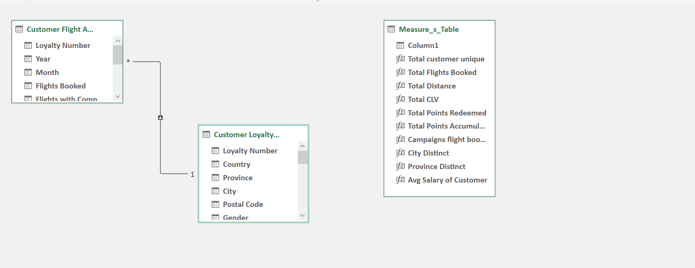
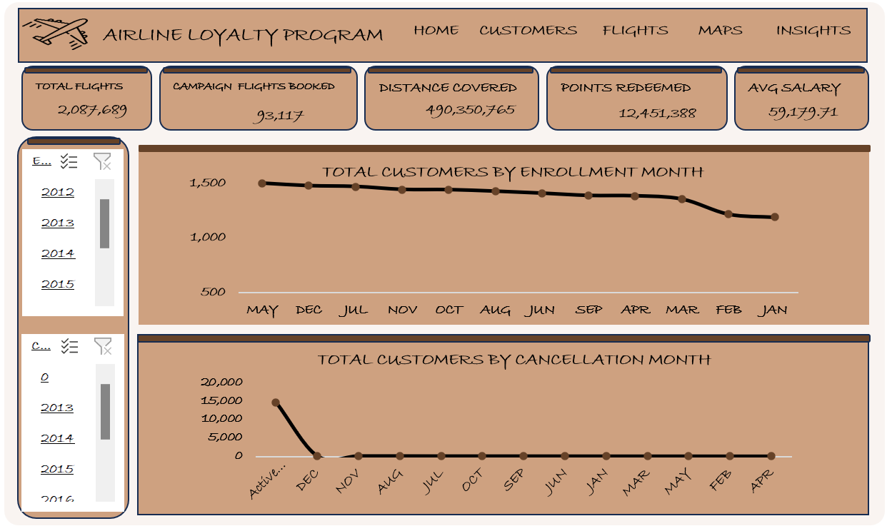
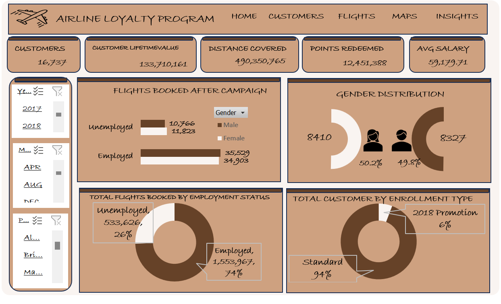
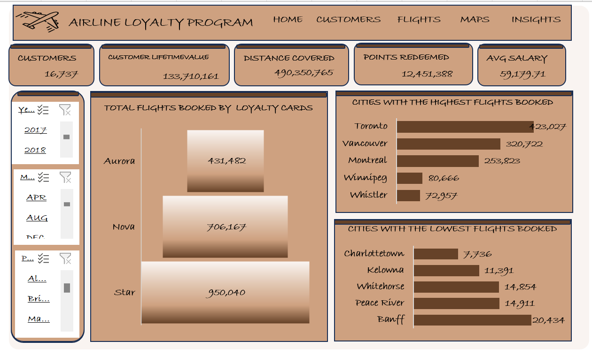
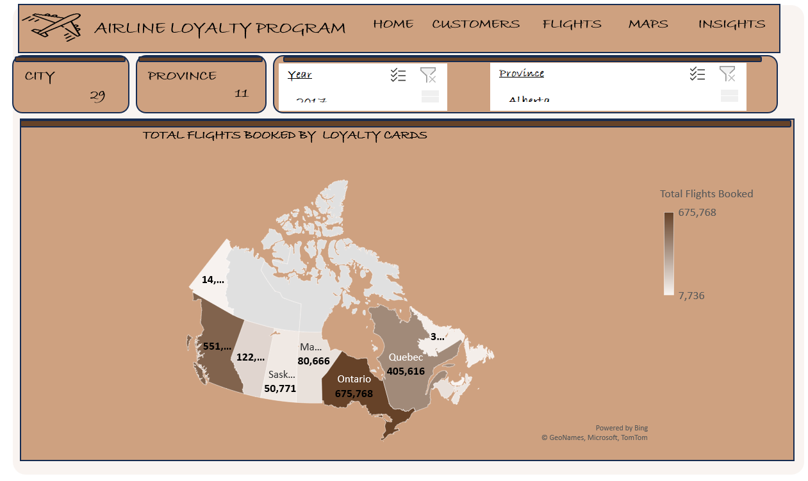
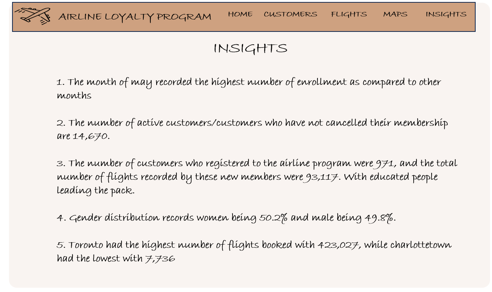

# Airline_loyalty_program

## Airline loyalty program analysis

---

## Introduction

Customer loyalty program data from Northern Lights Air (NLA), a fictitious airline based in Canada. In an effort to improveprogram enrollment, NLA ran a promotion between Feb - Apr 2018. Dataset includes loyalty program signups, enrollment and cancellation details, and additional customer information.

## Problem statement

1.What impact did the campaign have on the number of booked flights?
2. What people demographics are our loyal customers?
3. What is the fate of the members? Are we still in business? Is the number of people cancelling their membership lager than the active customers?
4. What demographics have our loyal customers?

## Data Source

This data was gotten from the Maven Analytics playground. Here is the (link) https://mavenanalytics.io/data-playground?search=airline%20loyalty%20program

## Data Cleaning

The dataset had two tables(customer loyalty history and a customer flight activity). A new table was also created in other to house our measures.
Various measures were created using the SUM function to form the explicit measure. A calculate function was also created, to calculate the total number of flights people who registered after the campaign booked. Null values were replaced with zero(0), from the query editor. Some columns were also dropped.

## Data Modelling

---

## Data visualization 

You can interact with the visualization (here)  https://eejay98-my.sharepoint.com/:x:/g/personal/faith-tech_eejay98_onmicrosoft_com/EUaT3teCU7xEjGSHjZKIP-kBcIJ9LEvU6E9KtngQwF2gLA?e=OS7yPT

## Home page

---

## Customers page

---

## Flights page

---

## Map page

---

## Insights page

---

---

